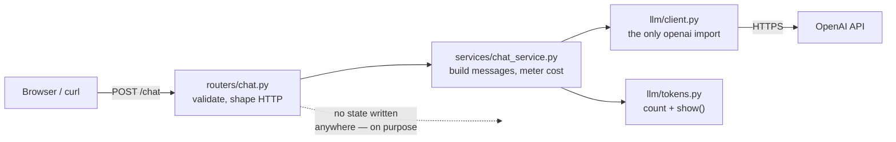

# Week 1 — In-session exercise: the `hr-assistant` chat service

**Ships by the end of this session:** `hr-assistant` v0 — a running FastAPI service that talks to an
LLM over HTTP, streams replies token by token, reports what every call cost, and can prove to you
that the model remembered nothing.

**Where the code goes.** Not in a notebook. Every student creates the repo below and writes into it
from minute one. The notebook (`week1.ipynb`) is the instructor's demo surface for the concept
block only — students read it, they do not build in it. This repo is the capstone; it is the same
repo in week 10.

```
hr-assistant/
  app/
    __init__.py
    main.py              # FastAPI app, startup checks, router wiring
    config.py            # env loading, model ids, pricing constants
    schemas.py           # Pydantic request/response models
    routers/
      chat.py            # /chat, /chat/stream, /compare
      health.py          # /health, /usage
    services/
      chat_service.py    # builds the message array, calls the client, meters cost
    llm/
      client.py          # the ONLY file that imports `openai`
      tokens.py          # tiktoken counting + the show() helper
  templates/
    chat.html            # the assignment: a Jinja-rendered chat page
  tests/
    test_health.py
    test_chat.py         # runs with a fake LLM client, no network
  .env.example
  requirements.txt
  README.md
```

**The one rule that survives all ten weeks:** `show(messages)` prints the exact array going over the
wire, with per-message token counts. Every week you must be able to answer *"what did the model
actually receive?"* If you can't, you are guessing.

---

## The shape of what we are building



The three layers are not ceremony. Next week a database layer slides in between the router and the
client, and nothing above or below it changes. If you put `openai` calls inside your route handler
today, you will rewrite your route handler next week.

---

## Functional requirements

Each one is numbered because the definition of done at the bottom refers to them. Acceptance is
stated as something you can actually run.

### FR-1 · Service runs and reports health

`GET /health` returns `200` with the configured model ids.

```json
{ "status": "ok", "simple_model": "gpt-4o-mini", "thinking_model": "o4-mini" }
```

**Accept:** `uvicorn app.main:app --reload` starts clean; `curl localhost:8000/health` returns the above.

### FR-2 · Configuration comes from the environment, and failure is loud

`OPENAI_API_KEY` is read from `.env` via `python-dotenv`. If it is missing, the app **fails at
startup** with a one-line message naming the variable — not on the first request, and never with a
stack trace containing the key.

- `.env` is gitignored. `.env.example` is committed and holds a placeholder only.
- The key is never logged, never returned in an error body, never put in a docstring.

**Accept:** `mv .env .env.bak && uvicorn app.main:app` exits immediately saying `OPENAI_API_KEY is not set`.

### FR-3 · `POST /chat` — one turn in, one reply out

Request:

```json
{ "message": "How many casual leaves do I get?", "model": "gpt-4o-mini", "temperature": 0.7 }
```

`model` and `temperature` are optional and default from config. Response:

```json
{
  "reply": "...",
  "model": "gpt-4o-mini",
  "usage": { "prompt_tokens": 42, "completion_tokens": 88, "total_tokens": 130 },
  "cost_usd": 0.0000591,
  "latency_ms": 940
}
```

**Accept:** a real call returns a real reply, and `usage` matches what the provider returned — you
report the API's numbers, not your own estimate.

### FR-4 · Layering is enforced, not suggested

- `routers/` imports from `services/`. It never imports `openai`.
- `services/` imports from `llm/`. It never touches `Request` or `HTTPException`.
- `llm/client.py` is the only module in the repo that constructs an `OpenAI()` client.

**Accept:** `grep -rn "import openai\|from openai" app/ | grep -v llm/client.py` prints nothing.

### FR-5 · Typed boundaries

Every request body and response body is a Pydantic model in `schemas.py`. Bad input returns FastAPI's
`422` without you writing a single `if` to check it.

**Accept:** `POST /chat` with `{"msg": "hi"}` returns 422 naming the missing `message` field.

### FR-6 · You can see the exact message array

`llm/tokens.py` has `show(messages)` which prints each message with its role, its token count, and
the running total. The chat service calls it on every request at DEBUG level, and `POST /chat?debug=true`
returns the same thing in the response body under `debug.messages`.

**Accept:** with `debug=true` you can read the full system + user array and its per-message token
counts in the HTTP response.

### FR-7 · The service is stateless, deliberately and visibly

Nothing is written anywhere — no dict, no list, no file, no database. Two consecutive calls to
`/chat` share nothing.

This is a requirement, not a gap in the design. `README.md` gets a short section titled
**"Why this service forgets you"** that states it in one paragraph.

**Accept:**

```bash
curl -s localhost:8000/chat -d '{"message":"My name is Priya."}' -H 'content-type: application/json'
curl -s localhost:8000/chat -d '{"message":"What is my name?"}'  -H 'content-type: application/json'
```

The second call does not know. It must not know.

### FR-8 · Memory is the caller's job — `history` passthrough

`POST /chat` accepts an optional `history` array of `{role, content}` messages. The service places
them between the system prompt and the new user message, in order, and sends the lot.

```json
{
  "message": "What is my name?",
  "history": [
    { "role": "user", "content": "My name is Priya." },
    { "role": "assistant", "content": "Nice to meet you, Priya." }
  ]
}
```

Now it answers correctly. Same stateless server, same model — the only thing that changed is what
you put in the request. **This is the single most important minute of the session.**

**Accept:** identical question, with and without `history`, produces a wrong and then a right answer.

### FR-9 · `POST /chat/stream` — tokens as they arrive

Server-sent events, `text/event-stream`. One event per chunk carrying the delta; a final event
carrying `usage`, `cost_usd` and `latency_ms`; then `data: [DONE]`.

**Accept:** `curl -N` shows text appearing progressively, not in one lump at the end.

### FR-10 · `POST /compare` — simple model vs thinking model, side by side

Runs the same prompt against `SIMPLE_MODEL` and `THINKING_MODEL` and returns both, each with its own
reply, latency, token usage and cost. Reasoning tokens, where the provider reports them, are shown
as their own line — students should see that they paid for output they never received.

**Accept:** one call, two results, and an obvious latency and cost gap on a hard question that
mostly vanishes on a trivial one.

### FR-11 · Upstream failures are handled like any other dependency

| Situation | Status | Body |
|---|---|---|
| Provider 4xx / 5xx | `502` | `{"error": "upstream_error", "detail": "<safe summary>"}` |
| Request exceeds the 30s timeout | `504` | `{"error": "upstream_timeout"}` |
| Bad request body | `422` | FastAPI default |

No provider stack traces and no key material reach the client. The timeout is a configured constant,
not a default you inherited.

**Accept:** run with a deliberately wrong API key — you get a clean 502, and the process stays up.

### FR-12 · `GET /usage` — the cost meter

A process-level counter: calls made, prompt tokens, completion tokens, total cost in USD since
startup, broken down per model.

```json
{ "calls": 14, "total_tokens": 8120, "cost_usd": 0.0041, "by_model": { "gpt-4o-mini": { "calls": 12, "cost_usd": 0.0009 } } }
```

It resets on restart. That is fine and it is the point — you will notice it resetting, and that
noticing is next week's assignment.

**Accept:** cost after N calls is non-zero and increases monotonically.

### FR-13 · Tests run without a network and without spending money

`tests/` uses FastAPI's `TestClient` with the LLM client replaced by a fake via dependency override.
At least: `/health` returns 200, `/chat` returns the expected shape, a missing field returns 422, and
an upstream exception maps to 502.

**Accept:** `pytest -q` passes with the machine offline and `OPENAI_API_KEY` unset.

### FR-14 · Config constants live in exactly one place

`config.py` holds `SIMPLE_MODEL`, `THINKING_MODEL`, the `PRICING` table and the system prompt.
Changing a model id anywhere in the app means editing one line.

> Prices move. Verify both model ids and all four numbers against the provider's current pricing page
> before the session — everything downstream reads these constants.

---

## Non-functional requirements

| # | Requirement |
|---|---|
| NFR-1 | Python 3.12+, dependencies pinned in `requirements.txt`, installed in a project venv |
| NFR-2 | `uvicorn app.main:app --reload` is the only command needed to run it |
| NFR-3 | Interactive docs work at `/docs` — every endpoint has a summary and example |
| NFR-4 | Every LLM call logs one structured line: model, prompt tokens, completion tokens, cost, latency |
| NFR-5 | No secret is ever written to a log, a response, or the repo |
| NFR-6 | `README.md` documents setup, endpoints, and the "why this service forgets you" note |

---

## The lab — break it, fix it, then plot what the fix costs

Diagnostic, not construction. It surfaces who has understood FR-7 and FR-8 and who has been copying.

1. **Break it.** Stop sending `history`. Hold a four-turn conversation that depends on turn one —
   give your name, then ask for it back. Watch it fail. Say out loud *why* it fails: the server is
   stateless, so the model received one message.
2. **Fix it.** Send `history` again. Same server, same model, different result. The only thing that
   changed is what was in the request.
3. **Plot the cost.** Run 20 turns with full history resent every time. Record `prompt_tokens` and
   `cost_usd` per turn and plot them. You get a curve, not a line.
4. **Explain the curve.** Turn 20 pays for turns 1 through 19 all over again. Prompt tokens grow with
   the square of the conversation, not with its length.

Nobody fixes point 4 today. That curve is the reason week 3 exists.

---

## Session timeline (240 min)

| Block | Min | Content |
|---|---|---|
| Recap + pre-work check | 15 | Everyone's venv runs, key works, hello-world responds |
| Concept | 45 | Next-token prediction · tokens as money and space · the message array · the model has no memory · temperature and top-p · simple vs thinking models |
| Live build A | 55 | FR-1 to FR-6 — skeleton, config, `/chat`, layering, `show()` |
| Live build B | 60 | FR-7 to FR-10 — statelessness demo, `history`, streaming, `/compare` |
| Lab | 45 | Break it / fix it / plot the cost curve + FR-11 to FR-13 (errors, `/usage`, tests) |
| Wrap + assignment brief | 20 | Acceptance criteria for the assignment read out loud |

If the room runs behind, cut `/compare` to an instructor demo and keep streaming. Never cut FR-8.

---

## Definition of done

Tick every box before you leave the room:

- [ ] FR-1 `GET /health` returns 200 with both model ids
- [ ] FR-2 missing key fails at startup with a clear message; `.env` is gitignored
- [ ] FR-3 `POST /chat` returns reply, usage, cost and latency
- [ ] FR-4 `grep` for the `openai` import finds only `llm/client.py`
- [ ] FR-5 a malformed body returns 422
- [ ] FR-6 `?debug=true` shows the full message array with token counts
- [ ] FR-7 the two-call name test proves the bot forgot
- [ ] FR-8 the same test with `history` proves it can be told
- [ ] FR-9 `curl -N /chat/stream` shows progressive output
- [ ] FR-10 `/compare` returns two results with different cost and latency
- [ ] FR-11 a bad key yields 502, not a crash
- [ ] FR-12 `/usage` totals climb across calls
- [ ] FR-13 `pytest -q` passes offline
- [ ] The lab's 20-turn cost curve is plotted and you can explain its shape
- [ ] Committed and pushed to your own `hr-assistant` repo, tagged `week-01-session`

---

## Explicitly out of scope this session

Naming these keeps the build from sprawling. Each one has a week.

| Not today | When |
|---|---|
| The chat UI — Jinja template, cost badge | Week 1 assignment |
| Typed/structured replies with Pydantic schemas | Week 2 |
| Any database, any persistence | Week 3 homework |
| Assembling history server-side, summarising, compacting | Week 3 |
| Auth, users, multi-tenancy | Not in this course |
| Docker, deployment, CI | Week 9 pre-work |
| RAG, tools, agents | Weeks 5–7 |

---

## The question to leave the room with

Your bot only remembers what you resend, and your lab curve says turn 20 pays for turns 1 to 19 all
over again. Both cannot stay true forever.

At what point do you stop sending the whole conversation — and what do you send instead?
