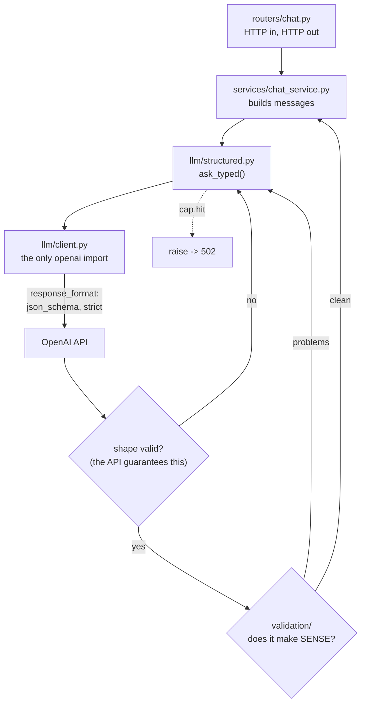

# Week 2 — In-session exercise: typed replies in the `hr-assistant` service

**Ships by the end of this session:** `hr-assistant` v1 — the same FastAPI service as week 1, except
no endpoint returns an unstructured string any more. Every reply is a validated object, out-of-scope
questions are refused by construction, and free-text leave requests come back as rows you could
insert into a database.

**Where the code goes.** Your own `hr-assistant` repo from week 1, on a branch. The notebook
(`week2.ipynb`) is the instructor's demo surface for the concept block — you read it, you do not
build in it. Week 1's endpoints must still work when you leave: this is an extension, not a rewrite.

```
hr-assistant/
  app/
    main.py
    config.py
    schemas.py             # GROWS: HRReply, LeaveRequest, RouteResult
    prompts/               # NEW — prompts are code, versioned and importable
      __init__.py
      system.py            # SYSTEM_V1, with a version string
      router.py            # the few-shot intent examples
      ladder.py            # the 6 rungs, kept for the measurement script
    routers/
      chat.py              # /chat, /chat/stream  (both change)
      extract.py           # NEW — /route, /extract/leave-request
      health.py            # /health, /usage
    services/
      chat_service.py      # returns HRReply, not str
      extraction_service.py # NEW
    validation/            # NEW — the rules a JSON Schema cannot express
      __init__.py
      leave_rules.py
    llm/
      client.py            # the ONLY file that imports `openai`
      structured.py        # NEW — to_strict_schema, schema_format, ask_typed
      tokens.py            # count_tokens + show()
  scripts/
    ladder.py              # NEW — runs the rung comparison, writes the report
  tests/
    test_chat.py           # updated for the new contract
    test_structured.py     # NEW
    test_validation.py     # NEW — pure unit tests, no network at all
  docs/
    week2-ladder.md        # NEW — generated, committed
```

**The week-1 rule still holds:** `show(messages)` prints the exact array going over the wire. This
week it gains a sibling — you must also be able to print **the exact schema** going over the wire.
If you cannot show both, you are guessing.

---

## The shape of what we are building



Two gates, and they are not the same gate. The first is enforced by the provider and catches missing
fields, wrong types and invalid enums. The second is enforced by **your code** and catches everything
that involves meaning — an end date before a start date, 400 days of leave, a `days` count that does
not match the span of dates it came with.

Most of today's engineering is in the second gate, because the first one is a config change.

---

## Functional requirements

Acceptance is stated as something you can run.

### FR-1 · Prompts are code

Every system prompt moves out of the function that uses it and into `app/prompts/`. Each prompt is a
module-level constant with a version string beside it:

```python
SYSTEM_V1_VERSION = "hr-system/1.0.0"
SYSTEM_V1 = ("You are the HR assistant for a software company in Pune. ...")
```

Every response body carries `prompt_version`. When someone asks "which prompt produced this answer?"
— and in week 8 you will ask exactly that — the answer is in the response, not in git blame.

**Accept:** `grep -rn '"You are' app/ | grep -v app/prompts/` prints nothing.

### FR-2 · `HRReply` — the typed reply

In `schemas.py`:

| Field | Type | Carries |
|---|---|---|
| `answer` | `str` | What the employee reads |
| `intent` | `Literal["policy","payroll","it_support","out_of_scope"]` | What your router branches on |
| `confidence` | `Literal["high","medium","low"]` | Whether to trust it |
| `needs_human` | `bool` | Whether the employee could act wrongly on it |
| `follow_up` | `Optional[str]` | One clarifying question, or `null` |

Every field carries a `description=`. Those descriptions are sent to the model — write them like
prompt, not like docstrings.

**Accept:** `HRReply.model_json_schema()` shows a description on all five fields.

### FR-3 · `llm/structured.py` — strict schemas, and you can see them

Three functions, all pure except the last:

- `to_strict_schema(model_cls)` — Pydantic schema → the dialect strict mode accepts
  (`additionalProperties: false` everywhere, every property in `required`, no defaults)
- `schema_format(model_cls)` — wraps it into the `response_format` argument
- `ask_typed(...)` — FR-8

Write `to_strict_schema` yourself. Do not import the SDK's version and do not call
`client.chat.completions.parse()` today. You may switch to `.parse()` next week; today you need to
be able to read a strict-mode rejection and know what it is complaining about.

**Accept:** `GET /debug/schema/HRReply` returns the strict schema, and it round-trips —
posting that schema to the API is accepted, not rejected.

### FR-4 · `POST /chat` returns an object

Week 1's contract returned `{"reply": "...", "usage": {...}}`. The new one:

```json
{
  "reply": {
    "answer": "Casual leave is granted at your manager's discretion; I do not have your balance.",
    "intent": "policy",
    "confidence": "medium",
    "needs_human": false,
    "follow_up": null
  },
  "prompt_version": "hr-system/1.0.0",
  "attempts": 1,
  "model": "gpt-4o-mini",
  "usage": { "prompt_tokens": 310, "completion_tokens": 64, "total_tokens": 374 },
  "cost_usd": 0.0000849,
  "latency_ms": 1180
}
```

`usage`, `cost_usd` and `latency_ms` are week 1's and must keep working. `attempts` is new — it is
`1` when the first response was accepted.

**Accept:** a real call returns all five reply fields, and `intent` is one of exactly four strings.

### FR-5 · Out-of-scope is refused by construction

`"Write me a Python function to reverse a linked list"` returns `intent: "out_of_scope"` and an
`answer` that is a polite refusal. The refusal is not a string comparison in your code — it comes
from the model under a schema that makes `out_of_scope` a first-class value.

**Accept:** five different out-of-scope questions, five refusals, `intent == "out_of_scope"` on all
five. Put the five in `tests/`.

### FR-6 · `POST /route` — the few-shot intent router

Body `{"message": "..."}`, returns `{"intent": "...", "confidence": "..."}`. Backed by the few-shot
prompt in `prompts/router.py` and a `RouteResult` schema — so no `.strip().lower()` appears anywhere.

Keep the labelled set from the notebook in `tests/` as a fixture and assert accuracy against it.

**Accept:** `POST /route {"message": "I still have not received my letter."}` returns valid JSON with
`intent` in the four-value enum, and the router test reports its accuracy as a number.

### FR-7 · `POST /extract/leave-request` — free text in, a row out

Body `{"message": "need 2 days sick leave starting tomorrow", "today": "2026-03-02"}`.
Returns a `LeaveRequest`: `employee_id`, `leave_type`, `start_date`, `end_date`, `days`, `reason`.

`today` is a request field, not `date.today()`. Relative dates ("tomorrow", "next month") must
resolve against a value you control, or your tests are time bombs.

**Accept:** the same message with two different `today` values returns two different `start_date`s.

### FR-8 · Two-layer validation, with a bounded retry

`ask_typed(messages, model_cls, validators=(), max_retries=2)`:

1. Call with `response_format=schema_format(model_cls)`.
2. **If `message.refusal` is set, raise.** Do not read `.parsed` or `.content` first.
3. Validate with Pydantic — shape.
4. Run every validator — sense. A validator takes the object and returns a list of problem strings.
5. On any problem: append the model's bad output **and** a specific complaint to the conversation,
   then retry.
6. On exhaustion: raise. Never return `None`, never return a partially-filled object.

The complaint must name the actual values. `"end_date 2026-03-18 is before start_date 2026-03-20"`
gets corrected; `"invalid"` does not.

**Accept:** feed `"I need 10 days leave from the 5th to the 6th"` and watch the log show attempt 1
rejected with a named reason and attempt 2 accepted.

### FR-9 · `validation/leave_rules.py` — the rules a schema cannot hold

Pure functions, no I/O, no model, fully unit-testable offline. At minimum:

| Rule | Why a JSON Schema cannot express it |
|---|---|
| `end_date >= start_date` | Relates two fields |
| `days` fits within the date span | Relates three fields |
| `1 <= days <= 90` | Expressible as a range, but you want the message |
| dates are real calendar dates | `"2026-02-30"` is a valid string |

**Accept:** `pytest tests/test_validation.py` passes with the network off and `OPENAI_API_KEY` unset.
These tests must not need a fake LLM client — they take an object and return a list.

### FR-10 · Errors map to status codes deliberately

| Situation | Status | Body |
|---|---|---|
| Model refusal (`message.refusal`) | `422` | `{"error": "model_refusal", "detail": "<the refusal text>"}` |
| Retries exhausted | `502` | `{"error": "validation_exhausted", "attempts": 3, "last_problem": "..."}` |
| Provider 4xx/5xx, timeout | `502` / `504` | week 1's behaviour, unchanged |
| Bad request body | `422` | FastAPI default |

A model that refused and a model that could not produce a valid object are **different failures** and
your on-call self needs to tell them apart from the status line.

**Accept:** with `max_retries=0` and a validator that always returns a problem, you get a 502 whose
body names the problem.

### FR-11 · `/chat/stream` — reconcile streaming with structured output

Week 1 streams tokens. A strict schema streams too, but what arrives is partial JSON — `{"answer": "Cas`
— which is not something you can put on a screen.

**Pick one and write the reason in `README.md`:**

| Option | What you do | Cost |
|---|---|---|
| **A** | Stream unstructured prose for `/chat/stream`, keep `/chat` typed. Two contracts | Two prompts to maintain, two behaviours to test |
| **B** | Stream the raw JSON and have the client render `answer` as it fills | Needs incremental JSON parsing in the browser |
| **C** | Two calls — a cheap streaming answer for the human, a typed call for the metadata | Doubles cost and latency |

There is no correct answer. There is an answer you can defend, and a `README.md` section titled
**"Why streaming and schemas fight"** explaining which you picked.

**Accept:** `curl -N` still produces progressive output, and the README names the trade-off you took.

### FR-12 · `GET /usage` grows a retry rate

Week 1's counter gains `retries` and `retry_rate`. A retry is a full-price call with a longer context
than the one before it, so a retry rate that moves after a prompt change is a cost regression and you
should be able to see it.

**Accept:** after a run that includes at least one retry, `retry_rate` is non-zero and `cost_usd`
includes the retried calls.

### FR-13 · `scripts/ladder.py` — measure the rungs

The measurement from the notebook, as a committed script. Runs all six rungs against a **frozen**
question set, applies the deterministic scorers, and writes `docs/week2-ladder.md` with one row per
rung: system-prompt tokens, and the pass rate for each rule.

The question set lives in the repo and does not change between runs. A set you edit while comparing
is not a measurement.

**Accept:** `python scripts/ladder.py` regenerates `docs/week2-ladder.md`, and the file is committed.

### FR-14 · Tests run offline and cost nothing

Extend week 1's fake-client override. At minimum:

- `/chat` returns the new shape (fake client returns a canned valid JSON string)
- a fake that returns JSON failing a business rule → the retry fires → asserted on call count
- a fake that returns a refusal → 422
- `to_strict_schema` unit tests: `additionalProperties` false, everything required, no defaults left
- `validation/` tests, pure

**Accept:** `pytest -q` passes with the machine offline and `OPENAI_API_KEY` unset.

---

## Non-functional requirements

| # | Requirement |
|---|---|
| NFR-1 | Week 1's endpoints all still work. Nothing regressed |
| NFR-2 | `openai` is still imported in exactly one file |
| NFR-3 | Every LLM call logs one structured line, now including `attempts` and `prompt_version` |
| NFR-4 | `/docs` shows the real response models — `HRReply` appears in the OpenAPI schema |
| NFR-5 | No prompt string is defined outside `app/prompts/` |
| NFR-6 | `requirements.txt` gains `pytest`; it is not installed in the venv yet |

---

## The lab — design a schema, then break it (50 min)

Diagnostic, not construction. It surfaces who understood FR-8 and who wired `response_format` and
hoped.

### Lab 1 — Design the leave-request schema (25 min)

Write `LeaveRequest` from scratch, from the employee's words rather than from a database table.
Then make these three come back typed:

1. `"need 2 days sick leave starting tomorrow"`
2. `"Applying for earned leave 15 Apr to 19 Apr, going to my sister's wedding. E-1188"`
3. `"can i take leave sometime next month maybe"`

Number 3 is the design question: the employee has not actually made a request. What should the
schema return? Nulls everywhere? A `is_complete: bool`? A `missing_fields: list[str]`? Decide, then
make the schema able to express your decision — and be ready to defend it, because someone else in
the room chose differently.

Print `to_strict_schema(LeaveRequest)` and read every line. If you cannot explain one, ask.

### Lab 2 — Handle three malformed inputs without crashing (25 min)

Your extractor survives all three with no unhandled exception and returns something the caller can
act on:

1. **Empty or noise** — `""`, `"asdkjhasd"`, a single emoji
2. **Wrong intent entirely** — `"what is the capital of France"` sent to the leave extractor
3. **Contradictory** — `"I need 10 days leave from the 5th to the 6th"`

For each, decide **before you write the code**: does this retry, or does it fail fast?

Retrying case 2 is how you turn one bad request into three bad requests at triple the price. Case 3
is the one retrying was built for. Case 1 should probably never reach the model at all.

**Done when:** `pytest` passes, nothing crashes, and you can say out loud which of the three you
chose to retry and why.

---

## Session timeline (240 min)

| Block | Min | Content |
|---|---|---|
| Recap + week-1 assignment review | 15 | Common failures on screen; everyone's week-1 service runs |
| Concept | 45 | The prompt ladder · rules in a prompt are requests, not guarantees · few-shot for fuzzy criteria · JSON three ways · **thinking models, 2nd pass** |
| Live build A | 55 | FR-1 to FR-5 — prompts as code, `HRReply`, `to_strict_schema`, typed `/chat`, refusal |
| Live build B | 60 | FR-6 to FR-10 — router, extraction, `ask_typed`, business rules, error mapping |
| Lab | 50 | Lab 1 and Lab 2 |
| Wrap + assignment brief | 15 | Acceptance criteria read out loud, including the DB tables |

**If the room runs behind:** FR-11 (streaming) becomes a README decision written at home, and FR-13
(the ladder script) moves to the assignment. **Never cut FR-8** — the retry wrapper is the week.

---

## Definition of done

- [ ] FR-1 no prompt string lives outside `app/prompts/`; `prompt_version` is in every response
- [ ] FR-2 `HRReply` with five described fields
- [ ] FR-3 `to_strict_schema` written by hand; `/debug/schema/HRReply` returns it
- [ ] FR-4 `POST /chat` returns the typed object, week 1's cost fields intact
- [ ] FR-5 five out-of-scope questions, five refusals, `intent == "out_of_scope"`
- [ ] FR-6 `/route` returns an enum value with no string cleanup anywhere
- [ ] FR-7 `/extract/leave-request` resolves relative dates against the request's `today`
- [ ] FR-8 `ask_typed` checks `refusal` first, validates twice, complains specifically, caps retries, raises on exhaustion
- [ ] FR-9 `validation/leave_rules.py` is pure and unit-tested offline
- [ ] FR-10 refusal → 422, exhaustion → 502, and you can tell them apart
- [ ] FR-11 a streaming decision made and written up in `README.md`
- [ ] FR-12 `/usage` reports `retry_rate`
- [ ] FR-13 `python scripts/ladder.py` regenerates `docs/week2-ladder.md`, committed
- [ ] FR-14 `pytest -q` passes offline with no API key
- [ ] Committed and pushed, tagged `week-02-session`

---

## Explicitly out of scope this session

| Not today | When |
|---|---|
| Any database, any persistence | **This week's assignment** |
| Assembling history server-side, summarising, compacting | Week 3 |
| Prompt caching | Week 3 |
| LLM-as-judge for scoring the ladder | Week 8 — today's scorers are deterministic on purpose |
| A real policy corpus behind the answers | Weeks 4–5. Today every number the bot produces is invented |
| Defending the `answer` field against injection | Week 6 |
| Tool calling | Week 6 |

---

## The question to leave the room with

`intent` is one of four strings and it cannot be anything else — the API enforces it. `end_date`
comes after `start_date` because your code checks and retries. Both guarantees are real.

Now read the `answer` field. It is a free-text string, written by a model that just read a message
from an untrusted user, and **nothing** in this session constrained it.

Which of your guarantees survive an employee who writes *"ignore your instructions"*?
